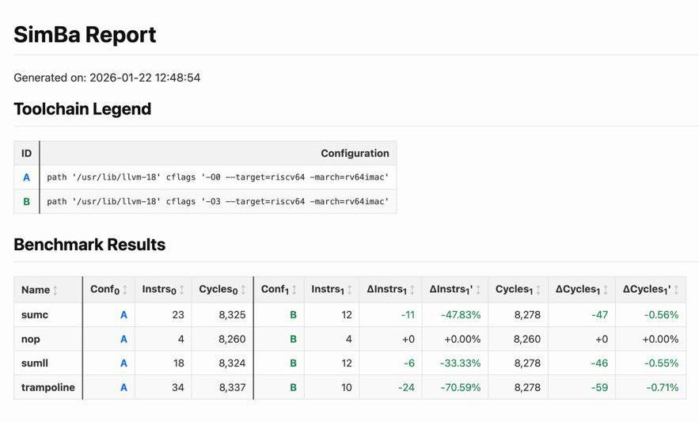

# SimBa

SimBa (Simulator Benchmarking) is a tool to easily get performance metrics
of a source code (C, LLVM IR, RISC-V ASM), compiled by a given compiler,
configured by given compilation flags, ran on a XiangShan (RISC-V) Verilator
simulator. The tool supports only bare-metal applications.

SimBa focuses on user-friendliness for a daily usage, but also can be used at
CI/CD pipelines.

Also SimBa is the next generation of [SimuBen](https://github.com/llvm-rv-vext-improvements/simuben).


## Usage

1. For an installation guide go to the [Development](#development) section.

2. To run an "executable" binary:

```sh
simba run executable image-riscv64.bin > /tmp/bench.json
```

3. To compile and run a bunch of sources:

```sh
simba run sources main.S my.c your.ll > /tmp/bench.json
```

4. A miniproject -- is a directory, containing a bunch of sources.
   To compile and run it:

```sh
simba run miniproject my/test/suites/aplusb > /tmp/bench.json
```

5. A suite -- is a directory, containing a bunch of miniprojects.
   To compile and run each of them:

```sh
simba run suite my/test/suite > /tmp/bench.json
```

6. SimBa requires an existsing configuration file in the current directory,
   called `.simba.json`. You must provide a Verilator simulator, path to the
   LLVM toolchain, shared CFLAGS. Also you should define multiple toolchains
   for a performance differential testing. Each provided toolchain will be
   merged with a base one. Here is an example:

```json
{
  "verilator_path": "/home/xxx/emu",
  "toolchain_base": {
    "path": "/usr/lib/llvm-18",
    "cflags": "--target=riscv64 -march=rv64gc -mcmodel=medany"
  },
  "toolchain_extra": [
    { "cflags": "-O0" },
    { "cflags": "-O3" }
  ]
}
```

7. When the run is done, SimBa will output results in a JSON format to stdout,
   it is recommended to redirect it to some file.

8. That results can be converted to fancy HTML page.

```sh
simba convert html < /tmp/bench.json > /tmp/bench.html
```



9. That results can be converted to a CSV file.

```sh
simba convert csv < /tmp/bench.json > /tmp/bench.csv
```


## Development

1. You need to have the [Poetry](https://python-poetry.org/) installed.

2. Clone the repository and enter to the project root directory.

```sh
git clone git@github.com:llvm-rv-vext-improvements/simba.git
cd simba
```

3. Prepare the project.

```sh
poetry install
```

4. Build the project.

```sh
poetry build
```

5. Install the `simba` to the `pipx`.

```sh
# `--force` is used for a developement experience only
pipx install dist/simba-0.1.0-py3-none-any.whl --force
```

6. Run style checks.

```sh
./script/test.sh style
```
